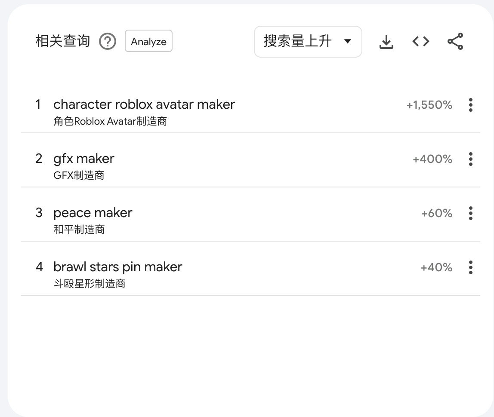

## 词根
基于词根，maker、creator、editor、checker、Calculator
### 谷歌趋势
[谷歌趋势](https://trends.google.com/trends/explore?date=now%207-d&q=maker)

### Google Search 下拉

### Google Search People also search for

## 网站
可以基于大流量内容站比如：reddit twitter youtube 等网站，也可根据关键词搜索排名靠前的网站，根据网站查看用户是搜索了哪些关键词进入的该网站，是否关键词自己可以做，注意排除品牌词

...持续写作中

